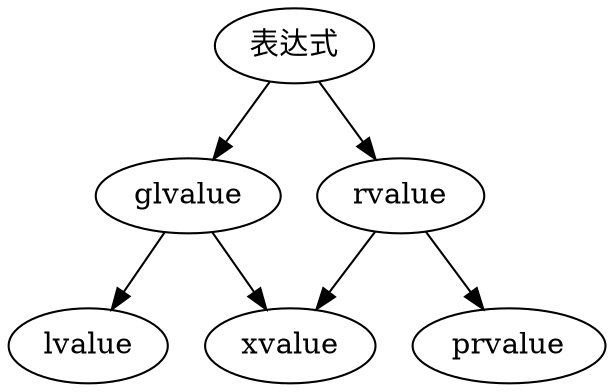

## C++中的表达式类型
&emsp;&emsp;C++和C语言有一个很大的不同，或者说一个较为现代的差异，也就是C++中*一切表达式都有类型，而且归属于**值的分类**（Value Catergory）*。
## 值的分类
&emsp;&emsp;**值的分类**告诉了编译器这个表达式的值所允许的行为，例如在值的移动，复制，产生时必须遵守的行为特征。不同于Rust中的`derive`来限定每个值的行为，C++更多是使用各种各样的标识符来规定。在C++17中，这个概念也被完整地描述了出来：


### 左值（lvalue）
>&emsp;&emsp;在官方文档中，除了左值和右值之外的值是这样定义的，我们在这里不进行详细的讲解，因为对于实际开发没啥用：  
> - **glvalue** 是一个表达式，它的求值决定了一个对象、位字段或函数的特性。
> - **prvalue** 是一个表达式，它的求值可以根据其出现的上下文初始化对象或位字段，或计算操作符操作数的值。
> - **xvalue** 是一个glvalue，表示一个对象或位字段，其资源可以重复使用（通常是因为其生命周期即将结束）。举例说明某些涉及rvalue引用（8.3.2）的表达式会产生xvalue，例如调用返回类型为rvalue引用的函数或将函数类型转换为rvalue引用类型。

&emsp;&emsp;左值通俗来讲，就是一种可以放在等号（赋值符号）左边的表达式。它提供了内存地址，所以程序可以更改其值，一般来讲
- **变量**包括**常量变量**均为左值（函数的参数也算是变量）
- **数组的成员**均为左值
- 满足一下返回值条件的**函数**均为左值
  - 是右值的引用
  - 是数组/指针等*拥有显式静态大小的数据容器*（Bit-fields）
  - 是结构体/类/共用体的引用
  - 是结构体/类的成员的引用
- `&`符号可以使得一个表达式类型成为左值引用类型（也就是最基本的引用类型，可被赋值）

```cpp
// --- 对于变量：
int i, j, *p;
int arr[3] = {1, 2, 3};
i = 0;     // 正确，i是左值
4 = i;     // 错误，4并不是左值
j * 4 = 8; // 错误，j * 4并不是左值
*p = i     // 正确，指针变量可以是左值
((i < 3) ? i : j) = 7; // 正确，三目条件运算可以是左值
arr[0] = 2;// 正确，数组的成员可以是左值

const int c = 12;
c = 13;    // 错误，c是一个无法被修改的左值

// --- 对于函数返回值：
int f1(int& i) {
  return i;
};

int& f2(int& i) {
  return i;
};

int* f3(int& i) {
  return &i;
};

int k = 0;
f1(k) = 1; // 错误，返回的类型`int`并不是一个左值
f2(k) = 1; // 正确，返回的类型`int&`是一个左值，执行后k == 1
*(f3(k)) = 2; // 正确，返回的指针类型解指针后仍然是一个左值`int&`，执行后k == 2

```

### 右值（rvalue）
&emsp;&emsp;右值就是只能放在等号右边的值，代表它没有提供值的内存访问，只有值的本身的读取操作，一般来讲包括下面表达式
- 字面量，如`"Hello World"`，`123`
- 返回值不是引用的函数调用
- 表达式解析中暂时产生的对象
- `&&`符号可以定义一个表达式类型为右值的引用类型

#### 右值的暂时性
&emsp;&emsp;右值不会像左值一样，在一条代码被分析完成后，在之后的代码中它依然会存在。它会在它所在代码被执行完成后，在其作用域释放。
```cpp
int i = 12; // 12是一个右值，它在这段代码之后将不会存在
int j = i;  // i是一个左值，它在这段代码之后依然存在，直到即将离开作用域后才会被释放
```
### 右值引用（&&）的特性
&emsp;&emsp;语义层面，`&&`的使用可以告诉我们函数的某个参数必须是一个**右值**，最常见的是在对赋值符号的重载：
```cpp
// 规定传入other必须是一个右值（A为某个类型名）
A& operator=(A&& other)
{
  //...
}
```
>**注意**  
>&emsp;&emsp;对于参数类型来讲，`&`与`&&`只是限定了传入的表达式类型必须是什么，可是，在函数之中，传入的值作为都会作为参数变量，所以无论限定如何，参数都将强制性转换为`左值`（因为毕竟，参数变量也是变量，总不可能是具有暂时性的右值）。所以下面的代码其实是合法的：
>```cpp
>void foo(int&& rv){
>  rv = 0; // rv是左值
>};
>foo(1); //传入参数必须是右值
>```
>**通用引用（T&&）**  
>&emsp;&emsp;我们可以借助模板类型的匹配机制，使用模板类型的`&&`使得左值和右值的输入均合法：
>```cpp
>void foo1(int&& rv){
>  // ...
>};
>
>void foo2(int& rv){
>  // ...
>};
>
>template <typename T>
>void foo(T&& rv){
>  // ...
>};
>
>int lv = 12;
>foo1(lv) // Error
>foo1(12) // Ok
>
>foo2(lv) // Ok
>foo2(12) // Error
>
>foo(lv) // Ok
>foo(12) //Ok
>```

#### 移动（Move）行为
&emsp;&emsp;C++默认行为中，一个基本类型的值（栈上的值）从一个作用域到令一个作用域会采用*复制*（Copy）的策略，也就是值再另一个作用域再复制一份。而我们使用`&`可以使得值在跨作用域时会采用*引用*的策略，在另一个作用于将会以引用（可修改的左值）的形式存在。不过在C++11中，我们可以找到`std::move`，它能够使值在跨域时采用`移动`策略，将生命周期给予新的作用域，而在旧作用域消失。（也就是把值从一处移动到了另一处）
> **std::move的实质**  
> &emsp;&emsp;这条函数在本质上类似于一种特别的`static_cast<T&&>`，也就是把一个值强制性地转化为`右值`，由于右值的暂时性，它在原作用域将不复存在，而在另一个作用域会创造一个类型为xvalue的表达式，此时xvalue会告诉编译器：我即将被释放了！请让其他作用域拥有我，拓展我的生命周期到它的区域，然后在那个区域再释放。（可以理解为`std::move`将值的生命周期以`xvalue`的形式拓展到了其他作用域，以`右值`的特性使得其在原作用域消失）
```cpp
std::vector<std::string> v;
std::string str = "example";
v.push_back(std::move(str));

int main() {
  std::cout << str; // 输出 ""，字符串的移动到了push_back之中
  return 0;
}
```
&emsp;&emsp;这样做有很多很多的优点，比如以下代码，我们写一个交换：
```cpp
template <class T>
swap(T& a, T& b) {
    T tmp(a); // 我们复制了一份a给tmp
    a = b;    // 我们又复制了一份b给a
    b = tmp;  // 我们又又复制了一份tmp给b
}
```
&emsp;&emsp;你会发现，本质上，交换就是两个值交换而已不涉及任何复制行为，但我们却创造了一堆复制的对象。不用多说，这种代码肯定会造成性能上的消耗。而当我们使用`移动`，交换就会仅仅有两个值的参与：
```cpp
template <class T>
swap(T& a, T& b) {
    T tmp(std::move(a)); // 将a移动给tmp
    a = std::move(b);    // 将b移动给a
    b = std::move(tmp);  // 将tmp移动给b
}
```

#### 转发（forward）行为
&emsp;&emsp;标准库中的`std::forward<class T>`，它实际上就是一种对参数类型一个处理，这种处理规则叫转发，下面我们以实际代码出发，来看看转发的用处：
```cpp
void inner(int& i) {
  std::cout << "Called by lvalue ref (&)";
};

void inner(int&& i) {
  std::cout << "Called by rvalue ref (&&)";
};

template <class T>
void foo(T&& t) {
  inner(t);
};

int main() {
  int i = 12;
  foo(i);   // 输出：Called by lvalue ref (&) 
  foo(12);  // 输出：Called by lvalue ref (&) 
  return 0;
}
```
&emsp;&emsp;`12`明显是一个右值，为什么会调用到`void inner(int& i)`而输出一个左值的结果呢？其实认真阅读上文就能发现问题，当12传入后，表达式`t`实际上就是一个`左值`了，或者说无论怎样，`t`永远是个`左值`，除非......
```cpp
void inner(int& i) {
  std::cout << "Called by lvalue ref (&)";
};

void inner(int&& i) {
  std::cout << "Called by rvalue ref (&&)";
};

template <class T>
void foo(T&& t) {
  inner(std::forward<T>(t)); //这里使用了转发
};

int main() {
  int i = 12;
  foo(i);   // 输出：Called by lvalue ref (&) 
  foo(12);  // 输出：Called by rvalue ref (&&) 
  return 0;
}
```
&emsp;&emsp;使用了`转发`之后，问题得到了解决。实际上，转发最大用处就是保留原参数的表达式类型，而不受强制左值转换的影响。对于`std::forward<T>(t)`，若`T`(传入参数类型)为左值则此表达式返回左值的t，若为右值则此表达式返回右值的t。

#### 移动与转发的比较
&emsp;&emsp;移动会将参数类型直接转化为右值，对象在当前作用域消失; 而转发会*因情况而定*，会根据传入的`T&&`具体引用形式来将参数转化为左值或者右值：
```cpp
void inner(int& i) {
  std::cout << "Called by lvalue ref (&)";
};

void inner(int&& i) {
  std::cout << "Called by rvalue ref (&&)";
};

template <class T>
void foo_forward(T&& t) {
  inner(std::forward<T>(t)); //这里使用了转发
};

template <class T>
void foo_move(T&& t) {
  inner(std::move(t)); //这里使用了移动
};

template <class T>
void foo_unset(T&& t) {
  inner(t); //这里什么都没用
};

int main() {
  int i = 12;

  foo_unset(i);   // 输出：Called by lvalue ref (&) 
  foo_unset(12);  // 输出：Called by lvalue ref (&) 

  foo_move(i);   // 输出：Called by rvalue ref (&&) 
  foo_move(12);  // 输出：Called by rvalue ref (&&) 

  foo_forward(i);   // 输出：Called by lvalue ref (&) 
  foo_forward(12);  // 输出：Called by rvalue ref (&&) 

  return 0;
}
```